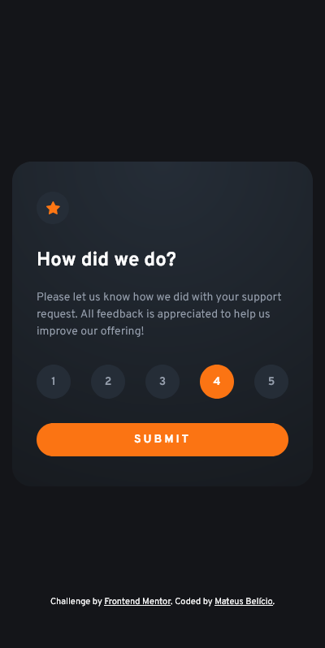

  
  <h2 align="left">Frontend Mentor - Interactive rating component solution</h2>

This is a solution to the [Interactive rating component challenge on Frontend Mentor](https://www.frontendmentor.io/challenges/interactive-rating-component-koxpeBUmI). Frontend Mentor challenges help you improve your coding skills by building realistic projects.

<!--  -->

&dot;
 
&dot;

---

### The challenge

Users should be able to:

- View the optimal layout for the app depending on their device's screen size
- See hover states for all interactive elements on the page
- Select and submit a number rating
- See the "Thank you" card state after submitting a rating

### Screenshot

 
 

### Built with

- Semantic HTML5 markup
- CSS custom properties
- Flexbox
- CSS Grid
- JavaScript for show the "Thank you" card state with the rating selected

### Useful resources

- [MDN - radial-gradient()](https://developer.mozilla.org/en-US/docs/Web/CSS/gradient/radial-gradient) - This helped me to better understand how the radial-gradient() function works and how to position and modify the radius to create the desired effect for the background.

---

### Author

- Frontend Mentor - [@mateusbelicio](https://www.frontendmentor.io/profile/mateusbelicio)
- Linkedin - [@mateusbelicio](https://www.linkedin.com/in/mateusbelicio)
